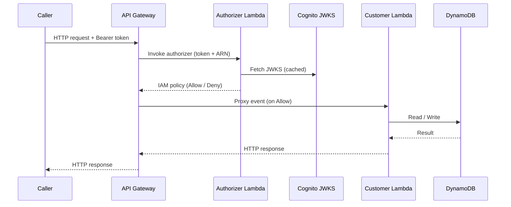

# Design Document: Customer Management API

## Overview

The Customer Management API is a serverless REST API that provides secure CRUD operations for customer records. It is built on AWS Lambda and API Gateway, with DynamoDB as the persistence layer and AWS Cognito as the identity provider.

Every inbound request passes through a Lambda Authorizer that validates the caller's Cognito-issued JWT before the request reaches the Customer Lambda. The Customer Lambda handles all business logic and data access. Terraform manages all infrastructure in `us-east-1`.

### Goals

- Single authoritative source of truth for customer data
- Stateless, scalable compute via AWS Lambda
- Strong authentication on every request via Cognito JWTs
- Consistent, machine-readable error responses and structured logs

---

## Architecture



### Request Flow

1. Caller sends an HTTP request with an `Authorization: Bearer <jwt>` header.
2. API Gateway invokes the Lambda Authorizer with the token and the requested resource ARN.
3. The Authorizer fetches the Cognito User Pool JWKS (cached in memory for the Lambda lifetime), validates the JWT signature, expiry, `iss`, and `aud` claims, then returns an IAM policy.
4. On `Allow`, API Gateway forwards the proxy event to the Customer Lambda.
5. The Customer Lambda validates the request body/path parameters, executes the DynamoDB operation, and returns a structured JSON response.

### Infrastructure Overview

```
API Gateway (REST)
  └── ANY /{proxy+}  →  Lambda Authorizer (TOKEN type)
                    →  Customer Lambda (AWS_PROXY integration)

DynamoDB Table: customers
  Primary Key:  customer_id (S)
  GSI:          email-index  →  email (S)  [for uniqueness checks]

Cognito User Pool
  App Client  →  issues JWTs consumed by the Authorizer
```

---

## Components and Interfaces

### 1. Lambda Authorizer (`src/authorizer/lambda_function.py`)

**Trigger**: API Gateway TOKEN authorizer  
**Input**: `{ "authorizationToken": "Bearer <jwt>", "methodArn": "arn:aws:..." }`

**Responsibilities**:
- Extract the Bearer token from the `authorizationToken` field.
- Fetch and cache the Cognito User Pool JWKS from `https://cognito-idp.<region>.amazonaws.com/<pool_id>/.well-known/jwks.json`.
- Verify the JWT signature using `python-jose`.
- Validate `iss` == Cognito User Pool issuer URL and `aud` == configured App Client ID.
- Validate token expiry (`exp` claim).
- Return an IAM `Allow` policy on success or `Deny` on any failure.
- Emit a structured JSON log entry for every authorization decision.

**Output** (IAM policy document):
```json
{
  "principalId": "<sub claim>",
  "policyDocument": {
    "Version": "2012-10-17",
    "Statement": [{
      "Action": "execute-api:Invoke",
      "Effect": "Allow | Deny",
      "Resource": "<methodArn>"
    }]
  }
}
```

**Error mapping**:
| Condition | Effect | API Gateway response |
|---|---|---|
| Missing / malformed token | Deny | 401 Unauthorized |
| Expired token | Deny | 401 Unauthorized |
| Invalid signature / wrong issuer or audience | Deny | 403 Forbidden |

> Note: API Gateway maps `Deny` to 403 by default. To return 401 for missing/expired tokens, the Authorizer raises an `Exception("Unauthorized")` which API Gateway translates to 401.

---

### 2. Customer Lambda (`src/customers/lambda_function.py`)

**Trigger**: API Gateway AWS_PROXY  
**Input**: API Gateway proxy event

**Route dispatch table**:

| Method | Path | Handler function | Success status |
|---|---|---|---|
| POST | `/customers` | `create_customer` | 201 |
| GET | `/customers` | `list_customers` | 200 |
| GET | `/customers/{customer_id}` | `get_customer` | 200 |
| PUT | `/customers/{customer_id}` | `update_customer` | 200 |
| DELETE | `/customers/{customer_id}` | `delete_customer` | 204 |

**Shared utilities** (within the same module or a `utils` sub-module):
- `validate_customer_input(body, required_fields)` — validates required fields and field formats.
- `build_response(status_code, body)` — constructs the API Gateway proxy response dict with `Content-Type: application/json`.
- `get_logger()` — returns a configured `logging.Logger` that emits JSON.

---

### 3. DynamoDB Access Patterns

| Operation | DynamoDB call | Key condition |
|---|---|---|
| Create | `put_item` (ConditionExpression: `attribute_not_exists(customer_id)`) | — |
| Email uniqueness | `query` on `email-index` GSI | `email = :email` |
| Get by ID | `get_item` | `customer_id = :id` |
| List (paginated) | `scan` with `Limit` + `ExclusiveStartKey` | — |
| Update | `update_item` | `customer_id = :id` |
| Delete | `delete_item` (ConditionExpression: `attribute_exists(customer_id)`) | — |

> Design decision: `scan` is acceptable for the MVP list endpoint given the expected data volume. A GSI on `created_at` can be added post-MVP if query patterns require ordered pagination.

---

### 4. API Gateway

- REST API (not HTTP API) to support Lambda Authorizer TOKEN type.
- All routes use `AWS_PROXY` Lambda integration.
- A single TOKEN-type Lambda Authorizer is attached to all methods.
- 405 Method Not Allowed is handled by API Gateway's default gateway response for `MISSING_AUTHENTICATION_TOKEN` / unsupported methods.
- Custom gateway responses configured for 401 and 403 to return consistent JSON bodies.

---

## Data Models

### Customer Record (DynamoDB item)

```json
{
  "customer_id":  "550e8400-e29b-41d4-a716-446655440000",
  "first_name":   "Jane",
  "last_name":    "Doe",
  "email":        "jane.doe@example.com",
  "created_at":   "2024-01-15T10:30:00Z",
  "updated_at":   "2024-01-15T10:30:00Z",
  "phone":        "+15551234567",
  "company":      "Acme Corp",
  "notes":        "VIP customer"
}
```

**Field definitions**:

| Field | Type | Required | Constraints |
|---|---|---|---|
| `customer_id` | String (UUID v4) | Yes (system-generated) | Immutable after creation |
| `first_name` | String | Yes | Non-empty |
| `last_name` | String | Yes | Non-empty |
| `email` | String | Yes | Valid email format; unique across all records |
| `created_at` | String (ISO 8601) | Yes (system-generated) | Immutable after creation |
| `updated_at` | String (ISO 8601) | Yes (system-managed) | Updated on every PUT |
| `phone` | String | No | — |
| `company` | String | No | — |
| `notes` | String | No | — |

### DynamoDB Table Definition

```
Table name:   customers
Billing mode: PAY_PER_REQUEST
Partition key: customer_id (S)

GSI: email-index
  Partition key: email (S)
  Projection:    KEYS_ONLY
```

### API Request / Response Schemas

**POST /customers — Request body**:
```json
{
  "first_name": "Jane",
  "last_name":  "Doe",
  "email":      "jane.doe@example.com",
  "phone":      "+15551234567",
  "company":    "Acme Corp",
  "notes":      "VIP customer"
}
```

**GET /customers — Query parameters**:
- `limit` (optional, integer, default 20, max 100)
- `next_token` (optional, base64-encoded `LastEvaluatedKey`)

**GET /customers — Response body**:
```json
{
  "customers": [ { "...": "..." } ],
  "next_token": "<base64 encoded LastEvaluatedKey or null>"
}
```

**Error response body** (all 4xx / 5xx):
```json
{
  "error": "Descriptive message here"
}
```

### Structured Log Entry Schemas

**Customer Lambda — per-request log**:
```json
{
  "level":       "INFO",
  "timestamp":   "2024-01-15T10:30:00Z",
  "method":      "POST",
  "path":        "/customers",
  "customer_id": "550e8400-...",
  "status_code": 201,
  "duration_ms": 45
}
```

**Authorizer Lambda — per-decision log**:
```json
{
  "level":    "INFO",
  "timestamp":"2024-01-15T10:30:00Z",
  "outcome":  "allow",
  "reason":   null
}
```

---

## Correctness Properties

*A property is a characteristic or behavior that should hold true across all valid executions of a system — essentially, a formal statement about what the system should do. Properties serve as the bridge between human-readable specifications and machine-verifiable correctness guarantees.*

### Property 1: Customer creation round-trip

*For any* valid customer payload (with all required fields and a unique email), POSTing to `/customers` should return HTTP 201 and a response body containing all submitted fields plus a system-generated `customer_id`, `created_at`, and `updated_at`. A subsequent GET by that `customer_id` should return the same record. Optional fields (`phone`, `company`, `notes`), when provided, must also be present in the response.

**Validates: Requirements 1.1, 2.1, 6.2**

---

### Property 2: Invalid input is rejected with 400

*For any* POST or PUT request body that is missing one or more required fields, or that contains a field value violating the defined type or format constraints (e.g., malformed email), the Customer Lambda should return HTTP 400 with an error message that does not expose internal stack traces.

**Validates: Requirements 1.2, 3.3, 6.3**

---

### Property 3: Duplicate email is rejected with 409

*For any* two POST requests that share the same `email` value, the second request should return HTTP 409 regardless of all other field values.

**Validates: Requirements 1.3**

---

### Property 4: Customer IDs are unique UUID v4 values

*For any* collection of successfully created customer records, all `customer_id` values should be distinct and each should conform to the UUID v4 format (`xxxxxxxx-xxxx-4xxx-yxxx-xxxxxxxxxxxx`).

**Validates: Requirements 1.4**

---

### Property 5: Non-existent customer ID returns 404

*For any* GET, PUT, or DELETE request targeting a `customer_id` that was never created (or has been deleted), the Customer Lambda should return HTTP 404.

**Validates: Requirements 2.2, 3.2, 4.2**

---

### Property 6: List endpoint returns all created records

*For any* set of N customers created via POST, exhaustively paginating the GET `/customers` endpoint (following `next_token` until null) should yield a collection containing all N records.

**Validates: Requirements 2.3**

---

### Property 7: All returned records conform to the Customer schema

*For any* customer record returned by any endpoint (POST, GET single, GET list, PUT), the record should contain all required fields (`customer_id`, `first_name`, `last_name`, `email`, `created_at`, `updated_at`) with correct types, and no additional undeclared fields.

**Validates: Requirements 2.4, 6.1**

---

### Property 8: Update preserves immutable fields

*For any* customer record, after any number of PUT operations with valid payloads, the `customer_id` and `created_at` fields should remain identical to their values at creation time. The `updated_at` field should be greater than or equal to `created_at`.

**Validates: Requirements 3.4**

---

### Property 9: Delete then get returns 404

*For any* existing customer, after a successful DELETE (HTTP 204), a subsequent GET by the same `customer_id` should return HTTP 404.

**Validates: Requirements 4.1**

---

### Property 10: Missing or expired token returns 401

*For any* API endpoint, a request with no `Authorization` header, or with a token whose `exp` claim is in the past, should return HTTP 401 before reaching the Customer Lambda.

**Validates: Requirements 5.1, 5.2**

---

### Property 11: Wrong signature, issuer, or audience returns 403

*For any* API endpoint, a request bearing a JWT signed with a key not in the Cognito JWKS, or with an `iss` or `aud` claim that does not match the configured values, should return HTTP 403.

**Validates: Requirements 5.3, 5.6**

---

### Property 12: Unhandled exceptions return 500 without stack traces

*For any* request that causes an unhandled exception in the Customer Lambda (e.g., DynamoDB unavailable), the response should be HTTP 500 with a generic error message, and the response body should not contain Python exception class names, tracebacks, or file paths.

**Validates: Requirements 7.1**

---

### Property 13: Every request produces a valid structured log entry

*For any* request handled by the Customer Lambda, the emitted log output should be parseable as JSON and contain the fields `method`, `path`, `status_code`, and `duration_ms`. For any authorization decision made by the Authorizer Lambda, the emitted log output should be parseable as JSON and contain `outcome` and (when denying) `reason`.

**Validates: Requirements 7.2, 7.3**

---

## Error Handling

### HTTP Error Response Contract

All error responses use a consistent JSON envelope:

```json
{ "error": "<descriptive message>" }
```

No stack traces, exception class names, or internal file paths are ever included in responses.

### Error Code Mapping

| Scenario | HTTP Status | Source |
|---|---|---|
| Missing required field | 400 | Customer Lambda |
| Invalid field format (e.g., bad email) | 400 | Customer Lambda |
| Malformed JSON body | 400 | Customer Lambda |
| Email already exists | 409 | Customer Lambda |
| Customer ID not found | 404 | Customer Lambda |
| Unsupported HTTP method | 405 | API Gateway (gateway response) |
| Missing / expired JWT | 401 | Lambda Authorizer |
| Invalid JWT signature / wrong iss or aud | 403 | Lambda Authorizer |
| Unhandled exception | 500 | Customer Lambda |

### Authorizer Error Handling

The Authorizer uses two distinct mechanisms to produce the correct HTTP status:

- **401**: Raise `Exception("Unauthorized")` — API Gateway translates this to a 401 response.
- **403**: Return a `Deny` IAM policy — API Gateway translates this to a 403 response.

This distinction is necessary because API Gateway's default behavior for a `Deny` policy is 403, but callers expect 401 for authentication failures (missing/expired token) vs. 403 for authorization failures (wrong issuer/audience/signature).

### DynamoDB Conditional Write Failures

- `ConditionalCheckFailedException` on `put_item` → 409 (email conflict) or 404 (item not found on update/delete).
- All other `ClientError` exceptions from boto3 → logged at ERROR level, returned as 500.

### Input Validation

Validation is performed before any DynamoDB call:

1. Parse JSON body; return 400 on `json.JSONDecodeError`.
2. Check all required fields are present and non-empty; return 400 with the missing field name.
3. Validate `email` format using a regex; return 400 with field name.
4. Validate UUID format for path parameter `customer_id`; return 400 if malformed.

---

## Testing Strategy

### Dual Testing Approach

Both unit tests and property-based tests are required. They are complementary:

- **Unit tests** cover specific examples, integration points, and error conditions.
- **Property-based tests** verify universal properties across randomly generated inputs.

### Property-Based Testing

**Library**: [`hypothesis`](https://hypothesis.readthedocs.io/) (Python)

Each correctness property defined above maps to exactly one `@given`-decorated test. Tests are configured to run a minimum of 100 examples per property.

Each test is tagged with a comment in the format:

```
# Feature: customer-management-api, Property <N>: <property_text>
```

**Example**:

```python
from hypothesis import given, settings
from hypothesis import strategies as st

# Feature: customer-management-api, Property 2: Invalid input is rejected with 400
@given(st.fixed_dictionaries({
    "first_name": st.just(""),          # empty required field
    "last_name":  st.text(min_size=1),
    "email":      st.text(min_size=1),
}))
@settings(max_examples=100)
def test_missing_required_field_returns_400(payload):
    response = create_customer(payload)
    assert response["statusCode"] == 400
    assert "error" in json.loads(response["body"])
    assert "traceback" not in response["body"].lower()
```

**Property test file**: `tests/unit/test_properties.py`

### Unit Tests

**Location**: `tests/unit/`

Focus areas:
- Specific valid and invalid input examples for each endpoint handler.
- Email format validation edge cases (e.g., `user@`, `@domain.com`, unicode).
- UUID v4 generation and format verification.
- DynamoDB `ConditionalCheckFailedException` → 409 / 404 mapping.
- Authorizer: token with wrong `iss`, wrong `aud`, expired `exp`, missing header.
- Authorizer: valid token produces `Allow` policy with correct `principalId`.
- Log output parsing: assert emitted JSON contains required fields.

**Mocking strategy**: Use `unittest.mock.patch` to mock `boto3` DynamoDB client and `python-jose` JWKS fetch. No live AWS calls in unit tests.

### Integration Tests

**Location**: `tests/integration/`

- Deploy to a real AWS environment (dev stage) using Terraform.
- Use a real Cognito User Pool test user to obtain a valid JWT.
- Exercise the full request path: API Gateway → Authorizer → Customer Lambda → DynamoDB.
- Cover the happy path for each CRUD operation and the 401/403/404/409 error cases.
- Verify pagination by creating > `limit` records and following `next_token`.

### Test File Layout

```
tests/
├── unit/
│   ├── test_authorizer.py       # Authorizer unit tests
│   ├── test_customers.py        # Customer Lambda unit tests (examples)
│   ├── test_properties.py       # Hypothesis property-based tests
│   └── events/                  # Sample API Gateway proxy event JSON fixtures
└── integration/
    └── test_api.py              # End-to-end integration tests
```
